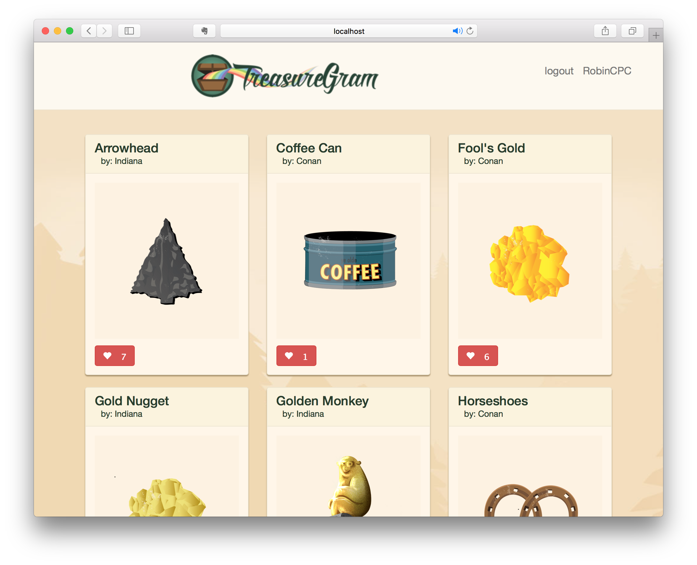
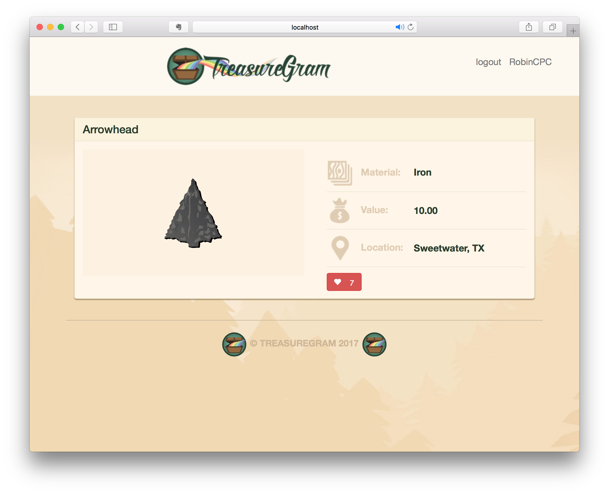
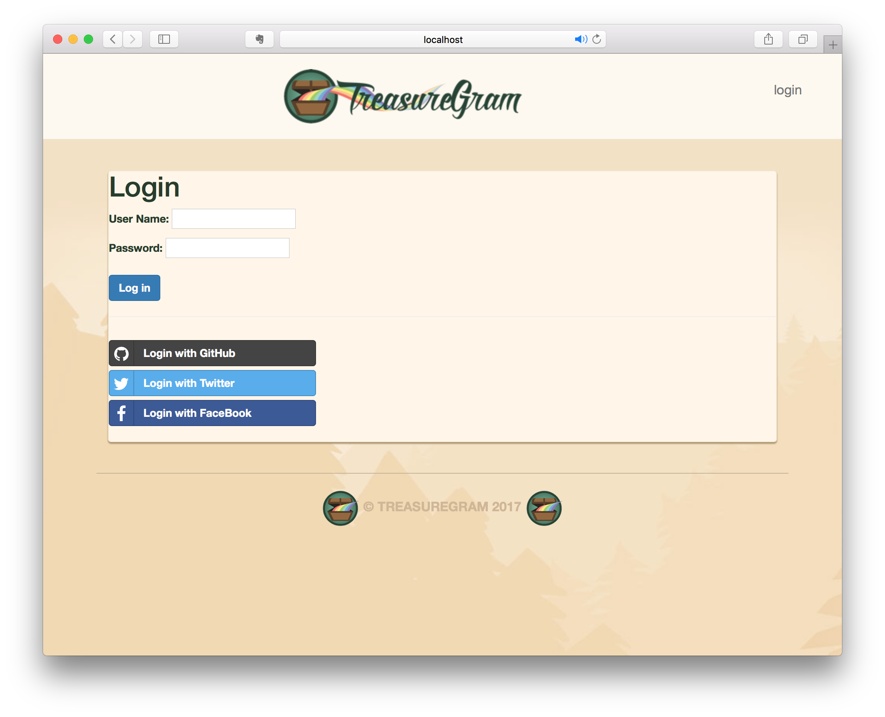
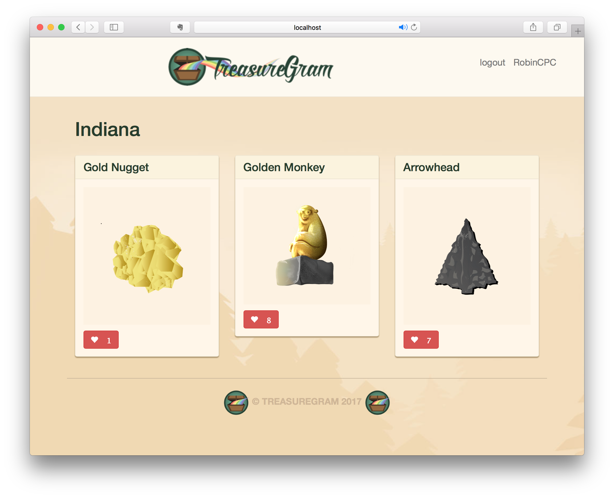
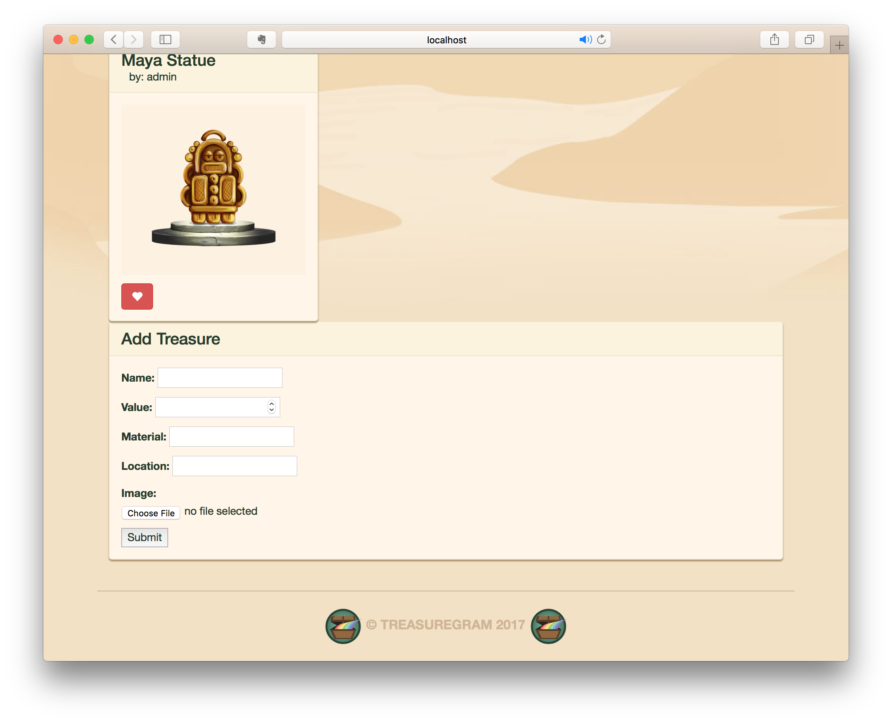

# django_treasuregram (Build a Pinterest-Like Web App)
## Django course from Code School

* Landing Page - List all pictures with `like` button.

* Detail Page - Show the detail of one picture.

* Login Page - Login with GitHub, Twitter, or Facebook (OAuth).

* Personal Page - Show pictures uploaded by certain user.

* Upload Form - Provide an upload form (according to Database).

